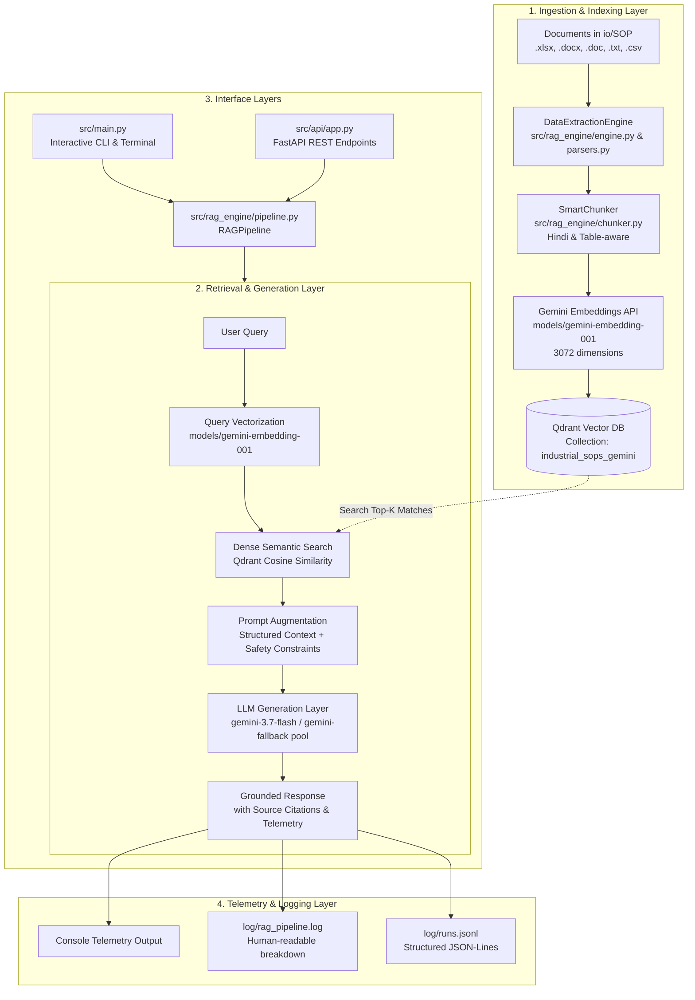

# Industrial SOP RAG Assistant (RAGBot)

An end-to-end, high-performance Retrieval-Augmented Generation (RAG) system built for industrial Standard Operating Procedures (SOPs), maintenance manuals, and technical safety documents. It supports multilingual queries (Hindi & English), table-aware semantic chunking, dense vector similarity search with Qdrant, and grounded synthesis powered by Google Gemini models.

---

## 1. System Architecture & Pipeline Flow



---

## 2. Key Features

- **Modular Clean Architecture**: Core RAG domain logic (`src/rag_engine/`) is cleanly separated from interfaces (`src/main.py` CLI and `src/api/` FastAPI REST API).
- **FastAPI RESTful Service**: Production-ready API with automatic OpenAPI Swagger documentation (`/docs`), request validation with Pydantic v2, file upload indexing, directory indexing, and telemetry endpoints.
- **Multilingual Domain Intelligence**: Native support for Devanagari Hindi, Hinglish, and English queries with zero translation loss.
- **Table-Preserving Chunking**: Specialized Markdown & Docx table splitters that preserve column headers across chunk boundaries.
- **Sub-Millisecond Vector Search**: Powered by Qdrant (embedded local database or high-performance remote server).
- **High-Dimension Embeddings**: Uses Google's 3072-dimensional `models/gemini-embedding-001` with automated rate-limit exponential backoff and multi-key rotation.
- **Resilient Generation & Model Fallbacks**: Defaults to `gemini-3.7-flash` with automatic fallback to `gemini-2.0-flash`, `gemini-3.5-flash`, and `gemini-3-flash-preview` on server load spikes.
- **Zero Hallucination Grounding**: Strict system prompt constraints ensure the assistant cites exact source files, sheets, and row ranges, refusing to invent steps when context is absent.
- **Fine-Grained Latency Tracking**: Records sub-millisecond timestamps for every individual layer (Query Embedding, Qdrant Search, Prompt Assembly, LLM Synthesis, and Total E2E Latency).

---

## 3. Project Directory Structure

```
d:\TSL\ragbot\
│
├── io/
│   └── SOP/                     # Industrial SOP source documents (.xlsx, .doc, etc.)
│
├── log/                         # Persistent execution logs
│   ├── rag_pipeline.log         # Human-readable timing & attribution logs
│   └── runs.jsonl               # Structured JSON-Lines telemetry records
│
├── qdrant_db/                   # Local embedded Qdrant vector database storage
│
├── src/
│   ├── __init__.py
│   ├── main.py                  # Interactive CLI entry point & terminal commands
│   │
│   ├── rag_engine/              # Core RAG Domain Package
│   │   ├── __init__.py          # Exports RAGPipeline, DataExtractionEngine, etc.
│   │   ├── chunker.py           # Smart semantic & table chunking
│   │   ├── engine.py            # File parsing orchestrator
│   │   ├── generator.py         # RAG synthesis engine & telemetry logger
│   │   ├── parsers.py           # Excel, Word, and Text document parsers
│   │   ├── pipeline.py          # Unified RAGPipeline orchestrator
│   │   ├── schema.py            # Dataclasses (DocumentChunk, ExtractedDocument)
│   │   └── vector_store.py      # Vector store manager (Qdrant + Gemini embeddings)
│   │
│   └── api/                     # REST API Layer (FastAPI)
│       ├── __init__.py
│       ├── app.py               # FastAPI application setup, CORS, lifespan
│       ├── routes.py            # REST endpoints (query, ingest, status, health)
│       └── schemas.py           # Pydantic v2 request & response models
│
├── test/
│   ├── test_api.py              # FastAPI endpoint integration tests
│   ├── test_engine.py           # Parser verification tests
│   ├── test_gemini_rag.py       # Ingestion & retrieval verification
│   ├── test_rag_2.py            # Multilingual query benchmarks
│   └── test_vector_store.py     # Qdrant client tests
│
├── .env.example                 # Template for API keys and configuration
├── README.md                    # System documentation
└── requirements.txt             # Python dependencies
```

---

## 4. Setup & Installation

### Prerequisites
- Python 3.10+
- Google Gemini API Key ([Google AI Studio](https://aistudio.google.com/))

### 1. Clone & Activate Virtual Environment
```powershell
# Windows PowerShell
python -m venv .venv
.venv\Scripts\Activate.ps1
```

### 2. Install Dependencies
```powershell
pip install -r requirements.txt
```

### 3. Configure Environment Variables
Create a `.env` file in the root directory:
```env
# Gemini API Key (Single or Multiple Keys for Automatic Rotation)
GEMINI_API_KEY=your_gemini_api_key_here
GEMINI_API_KEYS=key_1,key_2,key_3

# Generation & Embedding Models (Optional overrides)
GEMINI_GENERATION_MODEL=gemini-3.7-flash
GEMINI_EMBEDDING_MODEL=models/gemini-embedding-001

# Qdrant Configuration (Optional: defaults to local ./qdrant_db)
# QDRANT_URL=http://localhost:6333
# QDRANT_PATH=./qdrant_db
```

---

## 5. Running the REST API

Launch the FastAPI server with hot-reloading:
```powershell
.venv\Scripts\uvicorn src.api.app:app --host 0.0.0.0 --port 8000 --reload
```

Once running, explore interactive Swagger API docs at:
👉 **`http://localhost:8000/docs`**

### API Endpoints Summary

| Method | Endpoint | Description |
| :--- | :--- | :--- |
| `GET` | `/health` | Service healthcheck. |
| `GET` | `/api/v1/status` | Current Qdrant point count, active models, storage mode. |
| `POST` | `/api/v1/query` | Ask a question (Hindi/English), returns answer + sources + latency metrics. |
| `POST` | `/api/v1/ingest/file` | Ingest an individual file by local path. |
| `POST` | `/api/v1/ingest/upload` | Upload and ingest a file via multipart form. |
| `POST` | `/api/v1/ingest/directory` | Ingest all supported documents from a directory. |

#### Example: Query via cURL
```bash
curl -X POST "http://localhost:8000/api/v1/query" \
     -H "Content-Type: application/json" \
     -d '{
       "query": "कंप्रेसर का एयर प्रेशर कैसे सेट करते हैं?",
       "top_k": 3,
       "show_sources": true
     }'
```

---

## 6. Usage & CLI Reference

### A. Interactive CLI Session (Recommended)
Start the interactive question-answering assistant:
```powershell
.venv\Scripts\python.exe src/main.py
```

**Commands inside the interactive REPL:**
- Type any question in Hindi or English and press `Enter`.
- `:ingest <path>` — Index a new file or directory on the fly.
- `:status` — Check the total number of chunks currently indexed in Qdrant.
- `exit` / `quit` / `q` — Close the session.

---

### B. Single Query Direct Execution
Run a query directly from the terminal without entering the interactive prompt:
```powershell
.venv\Scripts\python.exe src/main.py -q "कंप्रेसर का एयर प्रेशर कैसे सेट करते हैं?" -k 3
```

---

### C. Ingesting Documents into the Vector Database
Ingest an entire folder of industrial SOPs:
```powershell
.venv\Scripts\python.exe src/main.py --ingest-dir io/SOP
```
Or ingest a single file:
```powershell
.venv\Scripts\python.exe src/main.py --ingest-file io/SOP/01_Compressor_Maintenance_SOP.XLSX
```

---

## 7. Verification & Benchmarks

Run the complete test suite:
```powershell
# Test Data Extraction Engine
.venv\Scripts\python.exe test/test_engine.py

# Test Vector Store & Embeddings
.venv\Scripts\python.exe test/test_vector_store.py

# Test Multilingual Query Benchmark
.venv\Scripts\python.exe test/test_rag_2.py

# Test FastAPI Endpoints
.venv\Scripts\python.exe test/test_api.py
```
