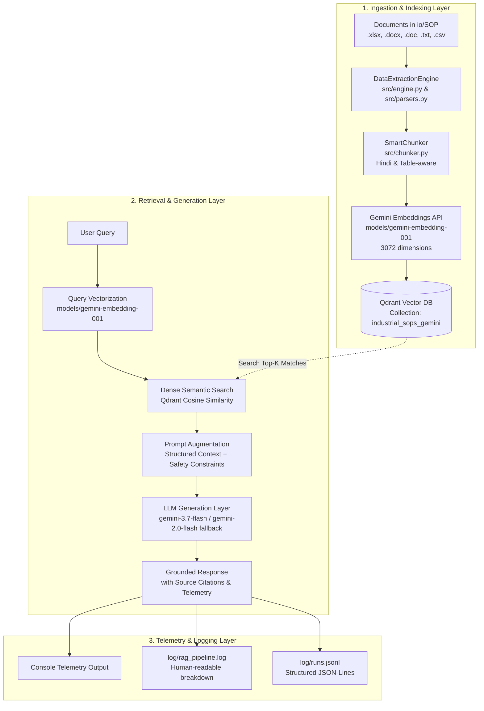

# Industrial SOP RAG Assistant (RAGBot)

An end-to-end, high-performance Retrieval-Augmented Generation (RAG) system built for industrial Standard Operating Procedures (SOPs), maintenance manuals, and technical safety documents. It supports multilingual queries (Hindi & English), table-aware semantic chunking, dense vector similarity search with Qdrant, and grounded synthesis powered by Google Gemini models.

---

## 1. System Architecture & Pipeline Flow



---

## 2. Key Features

- **Multilingual Domain Intelligence**: Native support for Devanagari Hindi, Hinglish, and English queries with zero translation loss.
- **Table-Preserving Chunking**: Specialized Markdown & Docx table splitters that preserve column headers across chunk boundaries.
- **Sub-Millisecond Vector Search**: Powered by Qdrant (embedded local database or high-performance remote server).
- **High-Dimension Embeddings**: Uses Google's 3072-dimensional `models/gemini-embedding-001` with automated rate-limit exponential backoff.
- **Resilient Generation & Model Fallbacks**: Defaults to `gemini-3.7-flash` with automatic fallback to `gemini-2.0-flash`, `gemini-3.5-flash`, and `gemini-3-flash-preview` on server load spikes.
- **Zero Hallucination Grounding**: Strict system prompt constraints ensure the assistant cites exact source files, sheets, and row ranges, refusing to invent steps when context is absent.
- **Fine-Grained Latency Tracking**: Records sub-millisecond timestamps for every individual layer (Query Embedding, Qdrant Search, Prompt Assembly, LLM Synthesis, and Total E2E Latency).

---

## 3. Project Directory Structure

```
d:\TSL\ragbot\
│
├── io/
│   └── SOP/                     # Industrial SOP source documents (.xlsx, .doc, etc.)
│
├── log/                         # Persistent execution logs
│   ├── rag_pipeline.log         # Human-readable timing & attribution logs
│   └── runs.jsonl               # Structured JSON-Lines telemetry records
│
├── qdrant_db/                   # Local embedded Qdrant vector database storage
│
├── src/
│   ├── __init__.py
│   ├── chunker.py               # Smart semantic & table chunking
│   ├── engine.py                # File parsing orchestrator
│   ├── generator.py             # RAG synthesis engine & telemetry logger
│   ├── main.py                  # Central application entry point & interactive CLI
│   ├── parsers.py               # Excel, Word, and Text document parsers
│   ├── schema.py                # Dataclasses (DocumentChunk, ExtractedDocument)
│   └── vector_store.py          # Vector store manager (Qdrant + Gemini embeddings)
│
├── test/
│   ├── test_engine.py           # Parser verification tests
│   ├── test_gemini_rag.py       # Ingestion & retrieval verification
│   ├── test_rag_2.py            # Multilingual query benchmarks
│   └── test_vector_store.py     # Qdrant client tests
│
├── .env.example                 # Template for API keys and configuration
├── README.md                    # System documentation
└── requirements.txt             # Python dependencies
```

---

## 4. Setup & Installation

### Prerequisites
- Python 3.10+
- Google Gemini API Key ([Google AI Studio](https://aistudio.google.com/))

### 1. Clone & Activate Virtual Environment
```powershell
# Windows PowerShell
python -m venv .venv
.venv\Scripts\Activate.ps1
```

### 2. Install Dependencies
```powershell
pip install -r requirements.txt
```

### 3. Configure Environment Variables
Create a `.env` file in the root directory:
```env
# Gemini API Key (Single or Multiple Keys for Automatic Rotation)
GEMINI_API_KEY=your_gemini_api_key_here
GEMINI_API_KEYS=key_1,key_2,key_3

# Generation & Embedding Models (Optional overrides)
GEMINI_GENERATION_MODEL=gemini-3.7-flash
GEMINI_EMBEDDING_MODEL=models/gemini-embedding-001

# Qdrant Configuration (Optional: defaults to local ./qdrant_db)
# QDRANT_URL=http://localhost:6333
# QDRANT_PATH=./qdrant_db
```

---

## 5. Usage & CLI Reference

### A. Interactive CLI Session (Recommended)
Start the interactive question-answering assistant:
```powershell
.venv\Scripts\python.exe src/main.py
```

**Commands inside the interactive REPL:**
- Type any question in Hindi or English and press `Enter`.
- `:ingest <path>` — Index a new file or directory on the fly.
- `:status` — Check the total number of chunks currently indexed in Qdrant.
- `exit` / `quit` / `q` — Close the session.

---

### B. Single Query Direct Execution
Run a query directly from the terminal without entering the interactive prompt:
```powershell
.venv\Scripts\python.exe src/main.py -q "कंप्रेसर का एयर प्रेशर कैसे सेट करते हैं?" -k 3
```

---

### C. Ingesting Documents into the Vector Database
Ingest an entire folder of industrial SOPs:
```powershell
.venv\Scripts\python.exe src/main.py --ingest-dir io/SOP
```
Or ingest a single file:
```powershell
.venv\Scripts\python.exe src/main.py --ingest-file io/SOP/01_Compressor_Maintenance_SOP.XLSX
```

---

### CLI Arguments Reference

| Argument | Short | Default | Description |
| :--- | :---: | :--- | :--- |
| `--query` | `-q` | `None` | Query string to execute directly without launching the interactive prompt. |
| `--ingest-dir` | `-i` | `None` | Path to a folder of documents to extract, chunk, embed, and index into Qdrant. |
| `--ingest-file` | | `None` | Path to an individual file to index. |
| `--top-k` | `-k` | `3` | Number of most relevant semantic chunks to retrieve. |
| `--collection` | | `industrial_sops_gemini` | Target Qdrant collection name. |
| `--model` | `-m` | `gemini-3.7-flash` | Gemini model name for the final generation layer. |
| `--no-sources` | | `False` | Suppress the printing of retrieved source snippets in terminal output. |

---

## 6. Telemetry & Execution Logging

Every query executed through `RAGGenerator` or `src/main.py` is logged automatically to the `log/` folder:

### 1. `log/rag_pipeline.log`
Human-readable records containing:
- Exact timestamp and question.
- Per-layer latency breakdown (Embedding time, Vector search time, Prompt assembly time, LLM synthesis time, and Total latency).
- Selected LLM and Embedding models.
- Retrieved document attributions (file name, sheet name, row numbers, similarity score).
- Complete synthesized answer.

### 2. `log/runs.jsonl`
Machine-readable JSON-Lines format suitable for automated evaluation, latency monitoring, and analytics.

---

## 7. Verification & Benchmarks

Run the benchmark suite:
```powershell
.venv\Scripts\python.exe test/test_rag_2.py
```
